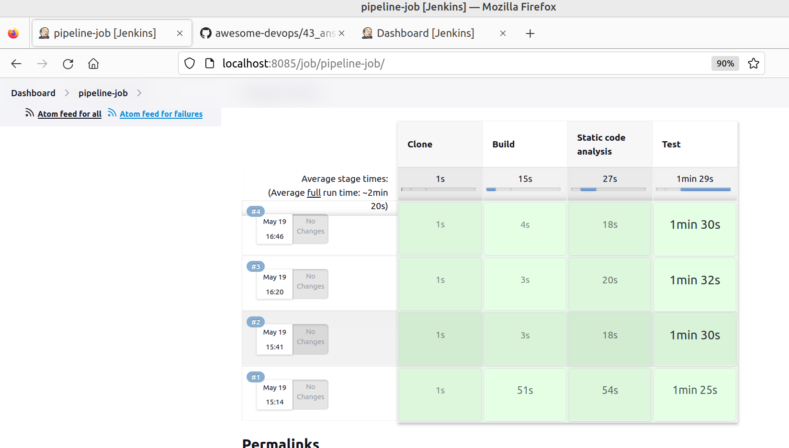
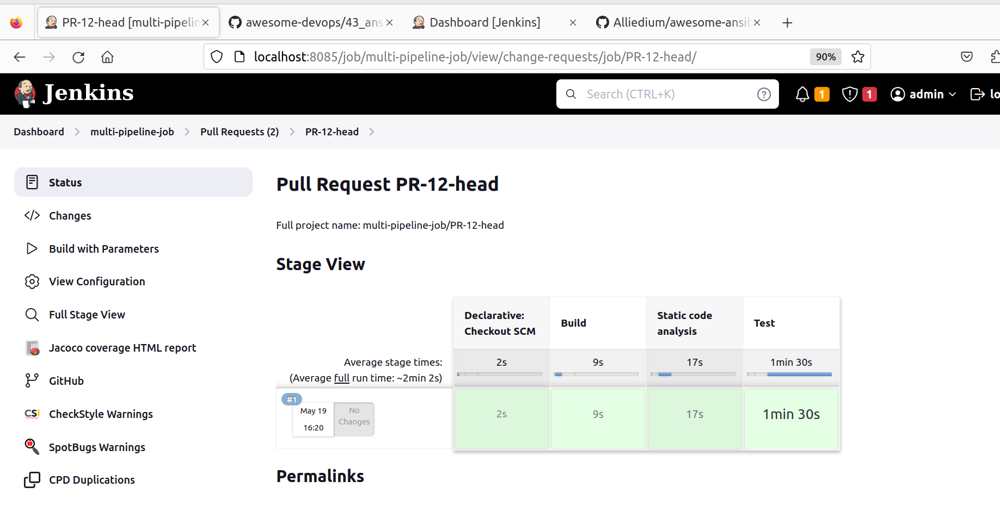

## This ansible playbook installs the [`jenkins`](https://www.jenkins.io/doc/) on the specified host ##

# Prerequisites
* Run the ansible playbook on `Debian` or `Ubuntu` Linux distribution. [We used Jammy ubuntu VM ](https://github.com/Alliedium/awesome-proxmox). Use the [script](https://github.com/Alliedium/awesome-proxmox/blob/main/vm-cloud-init-shell/.env.example) to create VM on `Proxmox`.  

* Install Ansible [Follow the second step](https://github.com/Alliedium/awesome-ansible#setting-up-config-machine)

* [Install `molecule`](https://molecule.readthedocs.io/installation/) on `Ubuntu` Linux. Molecule project is designed to aid in the development and testing of Ansible roles.
  
   ```
   apt update
   apt install pip
   python3 -m pip install molecule ansible-core
   pip3 install 'molecule-plugins[docker]'
   ```

## Playbook variables used in Jenkins server installation:

1. The HTTP port for Jenkins' web interface:

   `jenkins_port: 8085`

2. Admin account credentials which will be created the first time Jenkins is installed: - check users in role

   `jenkins_admin_user: admin`

   `jenkins_admin_password: admin`

3. Java version:
   
   `java_packages: - openjdk-17-jdk`

4. Install global tools. Maven versions:
    
    `jenkins_maven_installations:`
    
    `  - 3.8.4`
    
    `  - 3.9.0`

5. [List of plugins that will be installed](ListofJenkinsPluginsToBeInstalled.md)

## Instructions to install Jenkins with ansible playbook:

### 1. Clone repo and navigate to `awesome-jenkins` project:

  ```
  git clone https://github.com/Alliedium/awesome-jenkins.git $HOME/awesome-jenkins
  cd $HOME/awesome-jenkins
  ```

### 2. Install ansible roles for [Java](https://github.com/geerlingguy/ansible-role-java/), [Git](https://github.com/geerlingguy/ansible-role-git/), and [Jenkins](https://github.com/geerlingguy/ansible-role-jenkins) using commands:
   
   ```
   ansible-galaxy install --roles-path=./playbooks geerlingguy.git --force
   ansible-galaxy install --roles-path=./playbooks geerlingguy.java --force
   ansible-galaxy install --roles-path=./playbooks geerlingguy.jenkins --force
   ```

### 3. Run ansible playbook 

  This playbook contains multiple tasks that install `git`, `java`, `jenkins`, as well as plugins, tools and pipelines in `jenkins`. Using `Ansible` tags you can run a part of tasks. In our playbook we use 7 tags: `always`, `step1`, `step2`, `step3`, `step4`, `step5` and `step6`. Use `-t <tag_name>` flag to specify desired tag. They form a hierarchy of tags from `alway` to `step6`. In this hierarchy, each subsequent tag includes both its tasks and the tasks of the previous tag., e.g. if you run playbook with `step3` tag, will be run tasks tagged with `always`, `step1`, `step2` and `step3` tags.

   1. Before running tasks, check the list of tasks that will be executed using `--list-tasks` flag
   
   ```
   ansible-playbook ./playbooks/create-job.yml -i ./inventory --list-tasks

   ```

   You will receive a list of all tasks. Using `-t step2` when getting a list of tasks.

   ```
   ansible-playbook ./playbooks/create-job.yml -i ./inventory -t step2 --list-tasks

   ```

   You will receive a list of tasks, tagged `always`, `step1` and `step2`.


   2. Run all tasks from `playbook.yml` playbook. 
   
   ```
   ansible-playbook ./playbooks/create-job.yml -i ./inventory
   ```
   3. Run without installing any plugins in `jenkins`:
   
   ```
   ansible-playbook ./playbooks/create-job.yml -i ./inventory -t step1
   ```

   4. Run with installing [plugins](ListofJenkinsPluginsToBeInstalled.md) in `jenkins`:
   
   ```
   ansible-playbook ./playbooks/create-job.yml -i ./inventory -t step2
   ```

   5. Use `Step3` tag - install `python-jenkins`
   
   ```
   ansible-playbook ./playbooks/create-job.yml -i ./inventory -t step3
   ```

   6. Step4 - Add  `maven` tool
   
   ```
   ansible-playbook ./playbooks/create-job.yml -i ./inventory -t step4
   ```

   7. Step5 - Create and launch  `Jenkins pipeline job`
   
   ```
   ansible-playbook ./playbooks/create-job.yml -i ./inventory -t step5
   ```
   
   8. Step6 - Create and launch  `Jenkins multibranch pipeline job`
   
   ```
   ansible-playbook ./playbooks/create-job.yml -i ./inventory -t step6
   ```

### 4. Check `jenkins`

1. Go to the host specified in the `inventory/host.yml` file, open browser and check that Jenkins is available at http://localhost:8085/.
2. Login to Jenkins using the credentials.
3. You will see Jenkins dashboard. Open job.  
4. The main branch will be run for the single pipeline job 
5. The pull-requests will be run for the multibranch pipeline job.

## Project:
   As the example we used the following [project](https://github.com/Alliedium/springboot-api-rest-example)

## Job configuration:
   Job configuration is set in the `templates/job-config.xml.j2` and `templates/job-config-2.xml.j2`.
